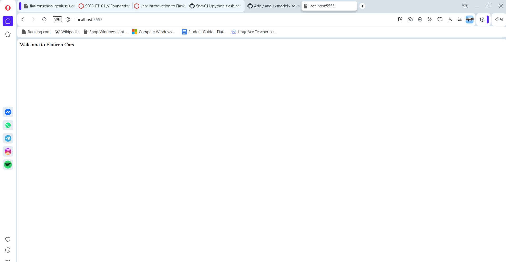

# Flatiron Cars - Flask Routes Lab

## Description

A small Flask application for a car company that exposes two routes:

- `GET /` — returns a welcome message for the company homepage.
- `GET /<model>` — checks whether the given car `model` exists in the
  company's fleet (`existing_models`) and returns a message confirming
  or denying its availability.

This project was built as a lab exercise to practice defining basic Flask
routes, including routes with dynamic URL parameters.

## Screenshot



## Getting Started

### Prerequisites

- Python 3.12
- [pipenv](https://pipenv.pypa.io/en/latest/)

### Installation

```bash
git clone git@github.com:<your-username>/python-flask-car-routes-lab.git
cd python-flask-car-routes-lab
pipenv install
pipenv shell
```

### Running the app

```bash
python server/app.py
```

The server starts on `http://localhost:5555`.

- Visit `/` to see the welcome message.
- Visit `/<model>` (e.g. `/M2`) to check if a model is in the fleet.

### Running tests

```bash
pipenv run pytest
```

## Project Structure

```
server/
  app.py          # Flask app and routes
  testing/        # Test suite for the routes
```

## License

See LICENSE.md.
